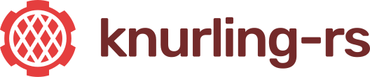

  
   

  <strong style="color: #742a2a">Get a grip on bare-metal Rust</strong>
   
   
  ▒▒▒▒▒▒▒▒▒▒▒▒▒▒▒▒▒▒▒▒▒▒▒▒▒▒▒▒▒▒▒▒▒▒▒▒

Our mission is to improve the embedded Rust experience. To achieve this, we build and improve tools and create learning materials.

To learn more, check out the project website at knurling.ferrous-systems.com.

To discuss new features and ideas, get involved in the [Issues section](https://github.com/knurling-rs/meta/issues) of this repository.

[Ferrous Systems]: http://ferrous-systems.com

  ▒▒▒▒▒▒▒▒▒▒▒▒▒▒▒▒▒▒▒▒▒▒▒▒▒▒▒▒▒▒▒▒▒▒▒▒

A Project By

    

