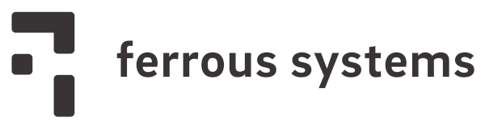

<h1 align="center">Knurling</h1>

  <strong>Get a grip on bare-metal Rust</strong>

  ▒▒▒▒▒▒▒▒▒▒▒▒▒▒▒▒▒▒▒▒▒▒▒▒▒▒▒▒▒▒▒▒▒▒▒▒

Knurling is an attempt at improving the tools and material used to build, debug, and learn embedded systems.

We believe that developing for embedded systems should be no more difficult than developing for hosted platforms. It should be possible to use the same workflows and equally powerful tooling to develop applications and libraries for tiny embedded systems as well as powerful server-class hardware.

To that end, we want to enable:

* Development and maintenance of high quality reference and teaching material
* Space-efficient and real-time capable logging
* Integration into your standard `cargo run` and `cargo test` workflows
* Execution tracing
* Simple data logging and visualization straight into your IDE or Browser
* ...and much more

For more information, check out our [announcement blog post].

[announcement blog post]: https://ferrous-systems.com/blog/knurling-rs/

If you would like to support this project, [consider supporting us via GitHub Sponsors][sponsor]. Thanks <3

[sponsor]: https://github.com/sponsors/knurling-rs

## Current Projects

These are the projects currently maintained and developed by the Knurling team. Thank you to our [sponsors][sponsor] for making these possible!

### Public Projects

The following projects are available for everyone to use!

* [probe-run](https://github.com/knurling-rs/probe-run) - A cargo runner for developing embedded applications like native applications
* [defmt](https://github.com/knurling-rs/defmt) - A highly efficient logging framework that targets resource-constrained devices, like microcontrollers.
* [app-template](https://github.com/knurling-rs/app-template) - A Cargo project template to get started with `probe-run` and `defmt`.

<!-- ### Early Sponsor Preview -->

<!-- The following projects are available for preview for [sponsors][sponsor] of Knurling. They will be made public at a later date. -->

### Coming Soon

We're working on the following items, and will make them available for Early Sponsor Preview soon!

* **Knurling Books** - Written guides that teach general concepts of embedded systems and Rust
* **Knurling Sessions** - Guided, hands-on tutorials for building projects like a CO2 Sensor, Data Loggers, and even robots!

  ▒▒▒▒▒▒▒▒▒▒▒▒▒▒▒▒▒▒▒▒▒▒▒▒▒▒▒▒▒▒▒▒▒▒▒▒

A Project By

    

